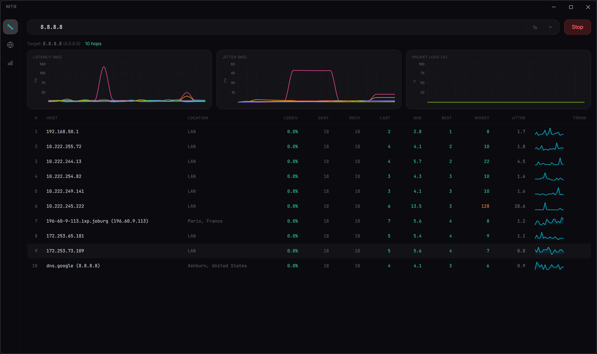
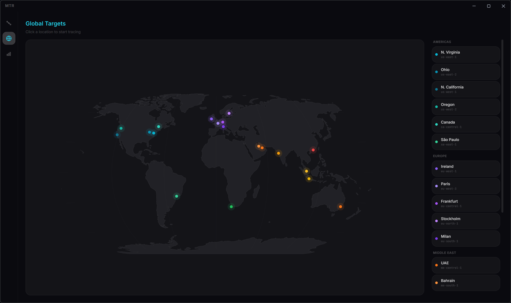
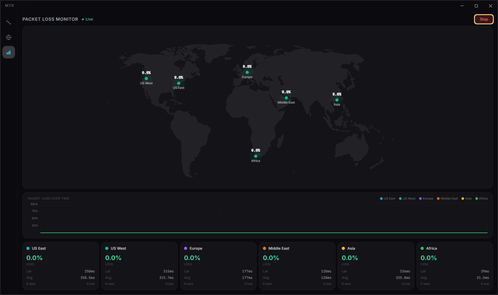

# Modern MTR

A beautiful, modern network diagnostic tool built with Electron, React, and TypeScript. Think [WinMTR](https://github.com/White-Tiger/WinMTR) but with a sleek dark UI, real-time charts, and global connectivity monitoring.



## Features

- **Real-time Traceroute** — Discover network hops and continuously monitor latency, jitter, and packet loss
- **Live Charts** — Latency, jitter, and packet loss visualized with interactive Recharts graphs and per-hop sparklines
- **Global Target Map** — Click-to-trace from 17 AWS regions worldwide with an interactive world map
- **Packet Loss Monitor** — Dashboard tracking real-time loss across 6 global endpoints
- **GeoIP Lookups** — Automatic geolocation and reverse DNS for every hop
- **Dark Theme** — Gorgeous dark UI with smooth Framer Motion animations

## Screenshots

### Global Target Selector
Click any AWS region on the interactive map to start a trace.



### Packet Loss Monitor
Monitor real-time packet loss to endpoints across the globe.



## Installation

Download the latest installer from [Releases](https://github.com/dbfx/modern-win-mtr/releases).

Or build from source:

```bash
git clone https://github.com/dbfx/modern-win-mtr.git
cd modern-win-mtr
npm install
npm start
```

## Building

```bash
# Package the app
npm run package

# Build installers (.exe + .zip)
npm run make
```

## Release

This project uses [Conventional Commits](https://www.conventionalcommits.org/) and [standard-version](https://github.com/conventional-changelog/standard-version) for automated changelog generation.

```bash
# Bump version, update CHANGELOG, tag release
npm run release

# Push with tags — GitHub Actions builds and publishes the release
git push --follow-tags origin main
```

## Tech Stack

- **Electron** 40 — Desktop runtime
- **React** 18 + **TypeScript** — UI framework
- **Vite** — Build tooling via Electron Forge
- **Tailwind CSS** — Styling
- **Recharts** — Charts and data visualization
- **React Simple Maps** — Interactive world map
- **Framer Motion** — Animations

## License

[MIT](LICENSE)
